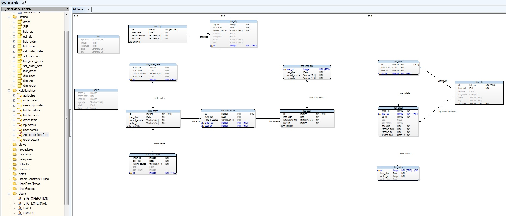

# ERD modelling

I have designed ERD model in Toad Data Modeler 5. So, file with results you can find here.
In the model, I designed two entities in staging area in different DB Schemas (STG external for API data and STG operation for operation DB data). 
In raw layer, (I called it DWH) I created few hub, satellite and link entities in Data Vault methodology. 
At the last data mart layer, which called DMGEO, I designed a star schema with fact - dimension methodology.
If you cannot open Toad Data Modeler, I attached an image.

