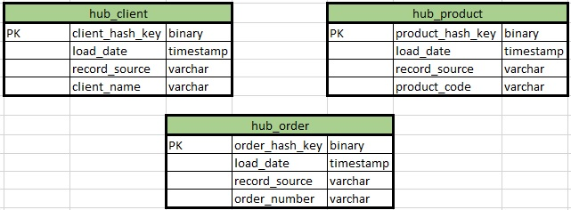
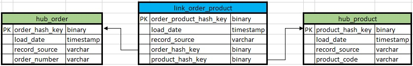
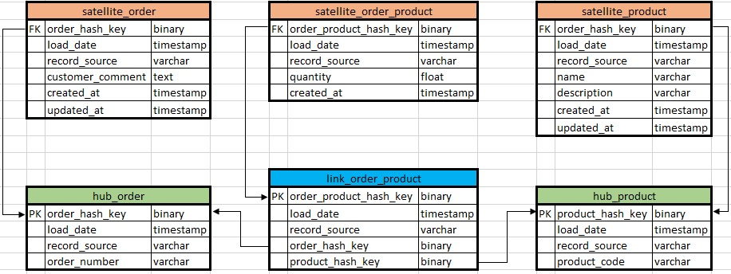

# Data Vaulr core entities

***
Hub
====

Hub is the basic representation of an entity (for example, Customer, Product, Order) in a business view. A table-Hub contains one or more fields in business keys. The ideal candidate for the title of a business key is the VIN code of the car. The business key must always be unique and unchanged.
Hub also contains load timestamp and record source meta-fields (the name of the system, database or file from which the data was loaded) are stored. Using MD5 or SHA-1 hash from the business key as the primary key of the Hub is recommended.

***
Link
====

Link entity is a table, which links several Hubs with many-to-many connections. It contains the same metadata as Hub. Link may be associated with another Link, but this approach creates problems with loading. So, better to select one of the Links and convert it in Hub.

***
Satellite
====

All descriptive attributes of the Hub or Links (context) are placed in Satellite entity. In addition, Satellite contains a standard set of metadata (load timestamp and record source) and one and only one “parent” key. In the Satellites, you can easily store the history of the context changes, each time adding a new record when the context is updated in the source system. For Hub or Link can have arbitrary number of Satellites, usually the context is divided according to the frequency of updates. Usually, context from different source systems puts in separate Satellites.

***