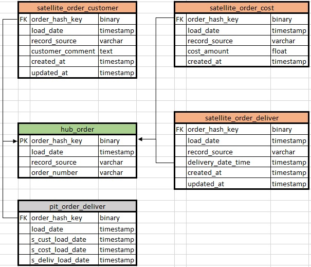
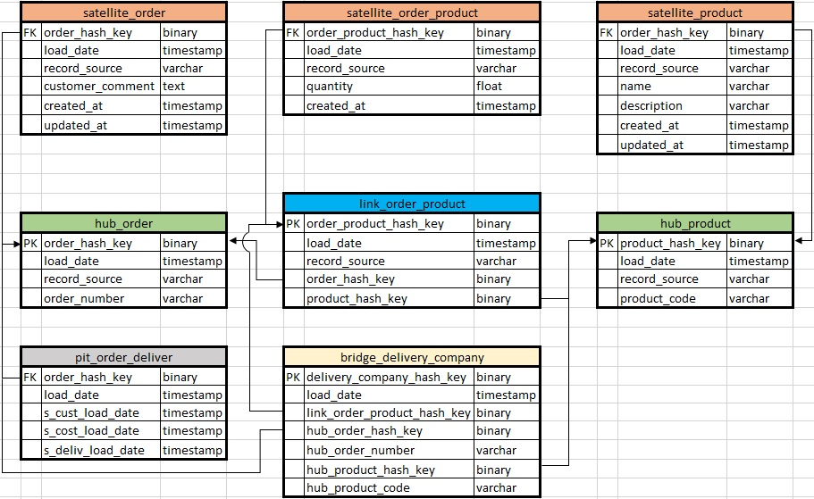

# Data Vault advance entities

***
Point in time
====

To calculate the validity range for each version, a Point in Time Table (PIT table) is created in the Data Vault model. It contains all combinations of load dates and is used to derive all valid versions that have to be loaded into a Slowly Changing Dimension Type 2 table.
A PIT table is connected to a Hub or a Link and is therefore a similar structure as a Satellite. But, unlike a normal Satellite, it does not contain descriptive attributes, but the load dates/timestamps of all other Satellites of the same Hub or Link.
The PIT table contains all distinct load dates of all Satellites. For each load date, the newest load date of every Satellite is stored in an additional attribute. This helps to identify what version is valid on a particular date.

***
Bridge
====

Like a Point-in-Time table, a Bridge table also makes it easier to query the Data Vault and helps performance at the same time. In the case of a Bridge table, it is used to help with joins that involve multiple Hubs and Links. It is really a derived Link table (linking multiple Hubs and Links together).
The Bridge table holds all the keys needed to get all the data from the right Satellites plus the text Business Keys for the Hubs.

***